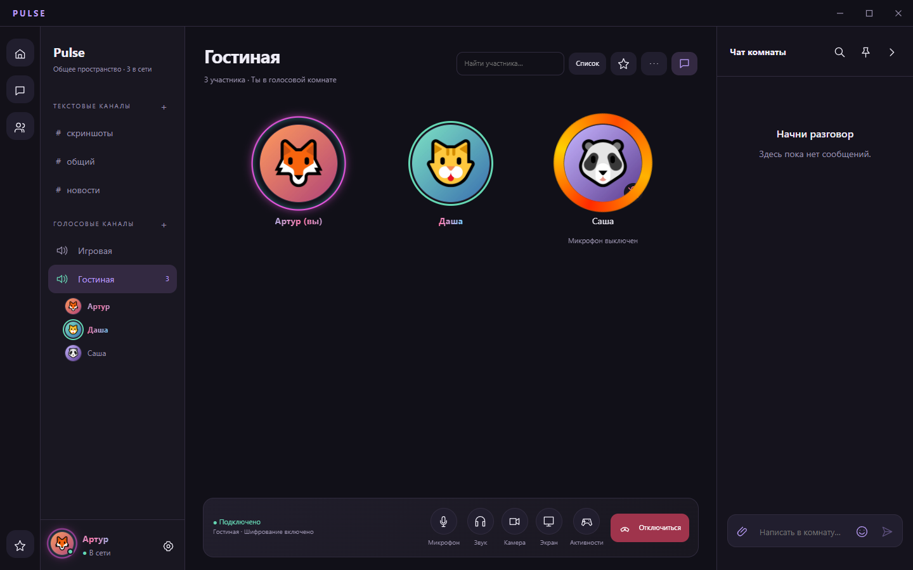
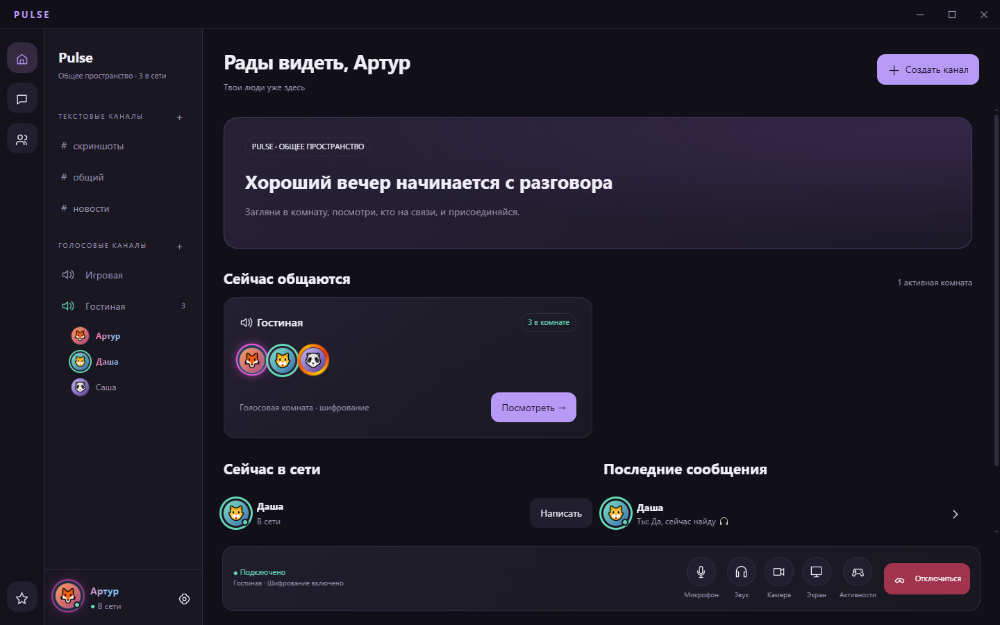
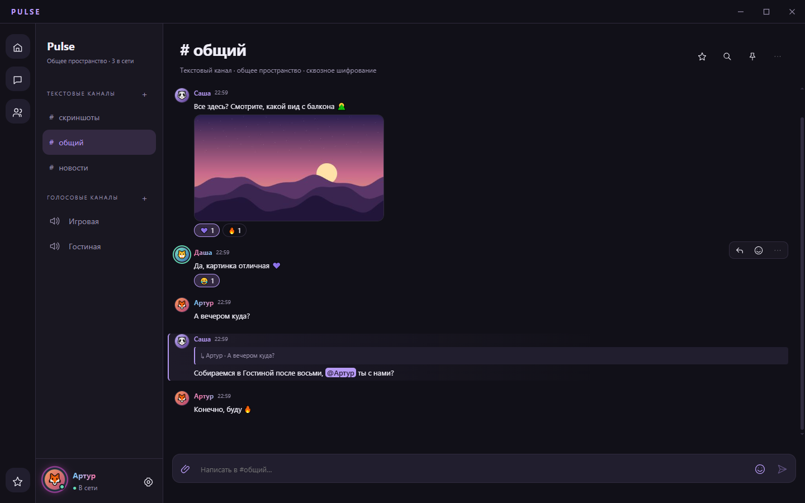
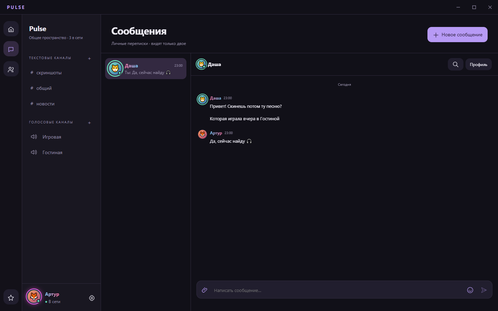
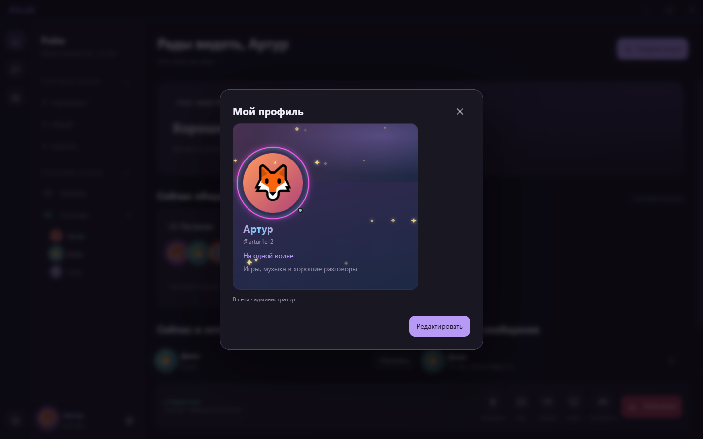
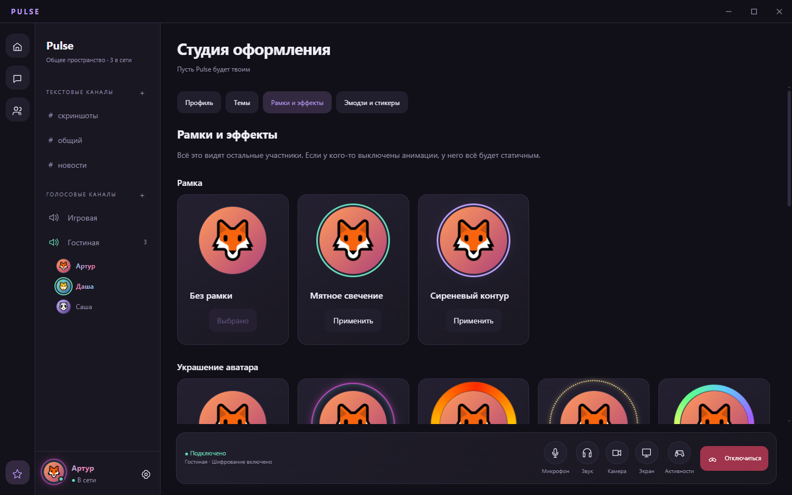
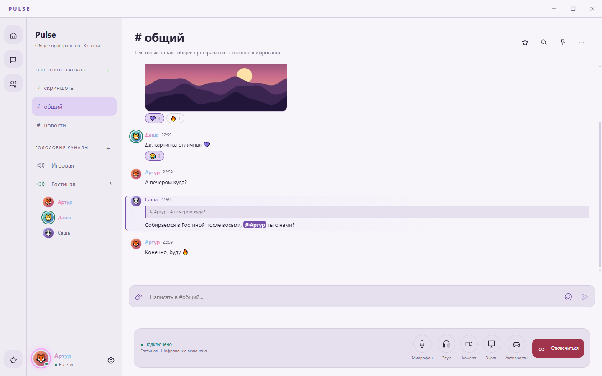
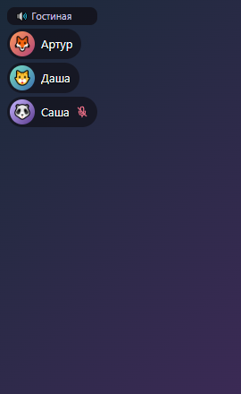

# Pulse

**Голос, игры и разговоры до ночи. Твоё место. Твои люди.**

Приватный мессенджер с голосовыми комнатами для своей компании. 
Всё шифруется на твоём компьютере — сервер не видит ни сообщений, ни файлов, ни голоса.

### [⬇️ Скачать Pulse для Windows](../../releases/latest)

---

## ✨ Что умеет

|  |  |
|---|---|
| 🎙️ **Голосовые комнаты** | Загляни в комнату, не заходя: видно, кто внутри и о чём чат. Шумодав, который убирает щелчки клавиатуры, и полная тишина, пока ты молчишь. |
| 💬 **Чат** | Ответы, реакции, правка, закрепы, поиск, @упоминания, «печатает…» и счётчики непрочитанного. |
| ✉️ **Личные сообщения** | У каждой переписки свой ключ — его нет даже у остальных участников группы. |
| 📎 **Файлы до 1 ГБ** | Скрепка, Ctrl+V скриншота или перетаскивание. Загрузка продолжается после обрыва связи. |
| 🎨 **Профиль как в Discord** | Анимированные баннеры (GIF и видео), цвета профиля, переливающиеся ники, украшения аватара, эффекты, свои стикеры. |
| 🎮 **Для игр** | Оверлей поверх игры с тем, кто говорит, и горячие клавиши микрофона, которые работают прямо в игре. |
| 🔔 **Уведомления** | Всплывашки Windows о личных сообщениях и упоминаниях; для каждого канала — свой режим. |
| 🔄 **Само обновляется** | Новая версия скачивается в фоне и проверяется подписью автора. Нажал «Перезапустить» — и готово. |

## 📸 Как выглядит

<table>
  <tr>
    <td width="50%">
<b>Главная</b> — кто сейчас общается
</td>
    <td width="50%">
<b>Чат</b> — ответы, реакции, упоминания, картинки
</td>
  </tr>
  <tr>
    <td>
<b>Личные сообщения</b> — свой ключ на каждую переписку
</td>
    <td>
<b>Профиль</b> — цвета, украшения, эффекты
</td>
  </tr>
  <tr>
    <td>
<b>Студия</b> — рамки, украшения и эффекты
</td>
    <td>
<b>Светлая тема</b> и три палитры
</td>
  </tr>
</table>

 <b>Оверлей в игре</b> — кто в комнате и кто говорит

---

## 📥 Установка — 3 минуты

> Нужна **Windows 10 или 11 (64-бит)**. Права администратора не нужны.

### 1. Скачай установщик

Открой **[последний релиз](../../releases/latest)** и в разделе **Assets** нажми на `Pulse-Setup-<версия>.exe`. 
Остальные файлы (`.blockmap`, `.sig`, `latest.yml`) нужны для автообновления — их скачивать не надо.

### 2. Запусти его

Windows может показать синее окно **«Windows защитила ваш компьютер»** — это нормально: у нас пока нет платной цифровой подписи Microsoft.

1. Нажми **«Подробнее»** (ссылка под текстом).
2. Появится кнопка **«Выполнить в любом случае»** — нажми её.

Дальше обычный мастер установки: можно выбрать папку, ярлык появится на рабочем столе.

Почему так и безопасно ли это?

SmartScreen предупреждает о любой программе без сертификата «с репутацией», а такой сертификат стоит денег. Подлинность Pulse проверяется по-другому: каждый установщик подписан ключом автора (файл `.sig` рядом), и при автообновлении Pulse сам проверяет эту подпись — подменённое обновление он не установит.

### 3. Зарегистрируйся

1. На экране входа нажми **«Регистрация по приглашению»**.
2. Введи **код приглашения** — его даёт администратор группы. Код одноразовый и действует 24 часа.
3. Придумай **логин** (латиница, цифры, `_ . -`) и **пароль** — не короче 10 символов.

### 4. Введи секрет группы

Это общий ключ шифрования вашей компании. Администратор передаёт его **отдельно от приглашения** — лично или в другом мессенджере.

- Вставляй **точно**, без лишних пробелов: с другим секретом ты не прочитаешь чат и не услышишь друзей.
- Вводится **один раз** на этом компьютере — дальше Pulse помнит его сам (в защищённом хранилище Windows).

### 5. Готово 🎉

Настрой профиль в **Студии** (звезда внизу слева), зайди в голосовую комнату — при первом входе Pulse предложит проверить микрофон и наушники.

---

## 🔄 Обновления

Pulse обновляется **сам**: качает новую версию в фоне, проверяет подпись и показывает плашку **«Обновление готово — Перезапустить»**. Можно просто закрыть и открыть приложение. Во время разговора установка ждёт, пока ты не отключишься.

Переустанавливать ничего не нужно, сообщения и настройки сохраняются.

## ❓ Частые вопросы

<b>Меня не слышно / микрофон не работает</b>

- Проверь, что микрофон включён в нижней панели звонка (иконка не красная).
- **Параметры Windows → Конфиденциальность → Микрофон** → включи «Разрешить классическим приложениям доступ к микрофону».
- **Настройки → Голос и видео** → выбери нужный микрофон и нажми «Проверить микрофон».
- Bluetooth-гарнитура с микрофоном переводит звук Windows в «телефонный» режим — лучше отдельный микрофон.

<b>Слышно клавиатуру или голос «режется»</b>

**Настройки → Голос и видео → Шумоподавление.** DeepFilterNet убирает щелчки сильнее всего. Если голос пропадает — поставь силу подавления «Мягко». Если компьютер слабый, Pulse сам переключится на лёгкий RNNoise.

<b>Не видно оверлея в игре</b>

Оверлей показывается во время звонка, когда окно Pulse свёрнуто или не в фокусе. Он работает в играх в режиме **«В окне»** или **«Полноэкранное окно» (borderless)**; в эксклюзивном полноэкранном режиме Windows его не показывает. Включается в **Настройки → Горячие клавиши и оверлей**.

<b>Не приходят уведомления</b>

- **Настройки → Уведомления** — проверь, что они включены и канал не в режиме «Ничего».
- Windows: отключи **«Не беспокоить» / «Фокусировку внимания»** и проверь, что уведомления Pulse разрешены в **Параметры → Система → Уведомления**.
- Уведомления не показываются о разговоре, который уже открыт в активном окне.

<b>Горячая клавиша не срабатывает</b>

Сочетание может быть занято другой программой — Pulse подскажет об этом в **Настройки → Горячие клавиши и оверлей**. Выбери другое.

<b>Забыл пароль</b>

Попроси у администратора код сброса пароля.

<b>Что-то сломалось</b>

**Настройки → Приложение → Диагностика → «Скопировать»** и отправь текст администратору. В отчёте нет паролей, ключей, сообщений и ников — только версии и коды ошибок.

<b>Как удалить</b>

**Параметры Windows → Приложения → Pulse → Удалить.** Настройки и вход остаются в `%APPDATA%\Pulse` — удали эту папку, если хочешь стереть всё.

## 🔒 Приватность

- Сообщения, файлы, профили, названия каналов и голос **шифруются на твоём компьютере** — на сервере только шифротекст.
- У каждого устройства свой ключ подписи: подделать сообщение от твоего имени нельзя.
- Личные переписки шифруются отдельным ключом, которого нет у остальных участников.
- Сервер не хранит логов с IP-адресами.

---

🛠 Для администратора: как выпустить новую версию

Сборку собирает и подписывает разработчик: новая версия появляется здесь **черновиком** (Draft).

1. Открой [Releases](../../releases), найди черновик → ✏️ **Edit**.
2. Отметь **«Set as the latest release»** → **Publish release**.

Или одной командой: `gh release edit vX.Y.Z -R AfterAlotLies/pulse-releases --draft=false --latest`

После публикации у всех Pulse обновится в течение часа (или при следующем запуске).

В этом репозитории — только готовые сборки. Исходный код приватный.

